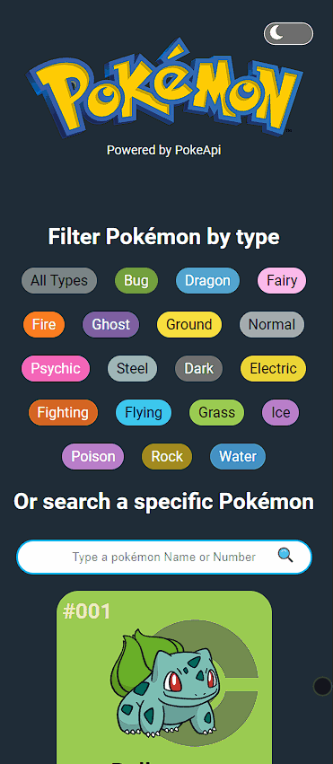

### <div align="center">Choose your language | Escolha seu idioma </div>

<div align="center">

[](https://github.com/edilan-ribeiro/pokemon-project/blob/main/README.en.md)
[](https://github.com/edilan-ribeiro/pokemon-project/blob/main/README.md) <br>


</div>
<br>
<a name="readme-top"></a>


<br />
<div align="center">
 <a href="https://github.com/github_username/pokemon-project">
    
  </a>

<h3 align="center">Pokemon Project - Powered by PokeApi</h3>

  <p align="center">
    It shows pokemon data!
  </p>
  
  <a href="https://pokemon-project-rho.vercel.app/">View Demo</a>
</div>

<br>

<details>
  <summary>Table of Contents</summary>
  <ol>
    <li>
      <a href="#about-the-project">About The Project</a>
      <ul>
        <li><a href="#built-with">Built With</a></li>
        <li><a href="#highlights">highlights</a></li>
        <li><a href="#challenges-and-lessons-learned">Challenges and lessons learned</a></li>
      </ul>
    </li>
    <li><a href="#usage">Usage</a></li>
    <li><a href="#contact">Contact</a></li>
  </ol>
</details>

<br><br>

## About The Project

 

<br>This project allows the user to obtain some pokemon data whether in the standard list, by search field or by type.

The data comes from PokeApi and is filtered for the display.

It's fully responsive!




<p align="right">(<a href="#readme-top">back to top</a>)</p>


### Built With

<div align="center">


</div>


<p align="right">(<a href="#readme-top">back to top</a>)</p>


## Highlights

To build the project, it was necessary to use several additional libraries, such as:

- React Hook Form: for form management
- Zod: for form validation
- React Spring: for transition animations
- React Router: to manage the pages
- useAnimations: for loading
- React Icons: for icons

Although many developers have already done similar projects (is this a <a href="https://media.tenor.com/GESYbde0oaYAAAAd/canon-event-lochan-bwefi.gif">canon event</a>? 🕸), the experience of building the components, dealing with various conditions, and handling the API calls was incredibly enriching. The process not only solidified my practical understanding, but also provided valuable insights into code architecture and optimization.

<p align="right">(<a href="#readme-top">back to top</a>)</p>

## Challenges and lessons learned

|💂🏼 | 👮🏼‍♀️| Separation of responsibilities was an initial challenge because at the beginning of a project, not all components exist, and even with thorough planning, something new often emerges to be added during the creation process.

📜 Forms in React operate in a slightly different manner than what I was accustomed to; here, we need to manage inputs in various ways. Thanks to React Hook Forms, I was able to implement the functionality in a more concise and optimized manner.

🕵️‍♂️ Still regarding forms, validation posed a significant challenge. With the creation of a schema in Zod, we can determine how the data will be treated. I chose to use a string, which raised some questions:

"If a user enters an invalid Pokémon ID, should we continue making API calls, even though the input being sent is not valid? 🤔"

To avoid this, it was necessary to create a rule that checks the input type with a regex. If the input is accepted by it, it is then converted into a number, and this converted input is used as a parameter for validation (🤯):
```javascript
 .refine(
	(value) =>
		/^\d+$/.test(value)
			? ((currentNumber) => {
					return (
						!isNaN(currentNumber) &&
						currentNumber >= 1 &&
						currentNumber <= 1017
					)
				})(Number(value))
			: value,
		{ message: "Must be a number between 1 and 1017" }
 )
```


💅 A new learning experience was the use of Styled Components to have styles within the components. The main advantages lie in knowing exactly where the style for that specific piece of code is located and the use of props to conditionally modify the style.

🎨 The design was complicated because I'm not the most creative person in the world. Navigating through the intricate details of the design required careful consideration of each visual element. Confronting this challenge allowed me to explore and develop strategies to overcome some of the limitations of my less creative approach, resulting in a design that, while challenging, turned out to be a significant achievement.

In summary, it was possible to learn and practice:
- Components and modification of props
- Forms and validations using React Hook Form and Zod
- Application of useContext
- Pages with React Router
- Styling with Styled Components

<p align="right">(<a href="#readme-top">back to top</a>)</p>

## Usage

After cloning, downloading, or forking, use the command below to install the project dependencies:
```shell
npm install
```


<p align="right">(<a href="#readme-top">back to top</a>)</p>

## Contact

💌 To send me a message, just use one of the buttons below!<br>

  <a href = "mailto:edilanbusiness@gmail.com" target="_blank"></a>
  <a href="https://www.linkedin.com/in/edilan-ribeiro-santos" target="_blank"></a> 
  <a href="https://whatsa.me/5561983769634/?t=Hello,%20I%20came%20from%20your%20GitHub!" target="_blank">
  </a>


<p align="right">(<a href="#readme-top">back to top</a>)</p>
